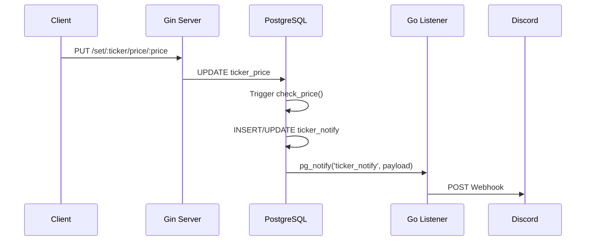

> [!NOTE]
> This README was generated by [Claude Code](https://gist.github.com/pardnchiu/b09c9bf1166ec7759cbbeeae2e4e93df), get the ZH version from [here](./README.zh.md).

# go-stock-notification

> A stock price notification service powered by PostgreSQL LISTEN/NOTIFY, automatically pushing Discord alerts when prices hit target thresholds.

## Features

- **Database-Driven Notifications**: Leverages PostgreSQL Triggers and pg_notify for real-time price monitoring without polling
- **Discord Integration**: Sends formatted embedded notification messages via Webhook
- **RESTful API**: Provides simple HTTP endpoints for setting prices and notification thresholds

## Architecture



## Installation

```bash
# Clone the repository
git clone https://github.com/neurowatt-dev/go-stock-notification.git
cd go-stock-notification

# Copy environment template
cp .env.example .env
# Edit .env with your database and Discord Webhook settings

# Start with Docker Compose
docker compose up -d
```

## Usage

### Set Notification Threshold

Configure the price level at which notifications trigger:

```bash
# Set AAPL notification price to 150.00
curl http://localhost:8080/set/AAPL/notify/150.00
```

### Update Stock Price

Update the latest stock price; crossing the threshold triggers a notification:

```bash
# Update AAPL price to 151.50
curl http://localhost:8080/set/AAPL/price/151.50
```

### Notification Logic

- **Breakout Up**: Triggers when price rises from below to at or above threshold
- **Breakdown**: Triggers when price falls from at or above to below threshold
- **Direction Change**: Notifications only sent on direction change to prevent duplicates

## Configuration Reference

### Environment Variables

| Variable | Description | Default |
|----------|-------------|---------|
| `DB_USER` | PostgreSQL username | `postgres` |
| `DB_PASSWORD` | PostgreSQL password | `password` |
| `DB_NAME` | Database name | `database` |
| `DB_PORT` | Database port | `5432` |

### Database Schema

| Table | Purpose |
|-------|---------|
| `ticker_price` | Stores ticker symbols with current and previous prices |
| `ticker_compare` | Stores notification threshold prices |
| `ticker_notify` | Stores notification state and trigger direction |

### API Endpoints

| Method | Path | Description |
|--------|------|-------------|
| GET | `/set/:ticker/notify/:price` | Set notification threshold |
| GET | `/set/:ticker/price/:price` | Update stock price |

## License

This is a private project.

## Author


<h4 style="padding-top: 0">邱敬幃 Pardn Chiu</h4>

<a href="mailto:dev@pardn.io" target="_blank">

</a> <a href="https://linkedin.com/in/pardnchiu" target="_blank">

</a>

***

©️ 2026 [邱敬幃 Pardn Chiu](https://linkedin.com/in/pardnchiu)
