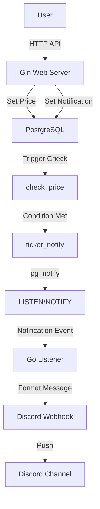
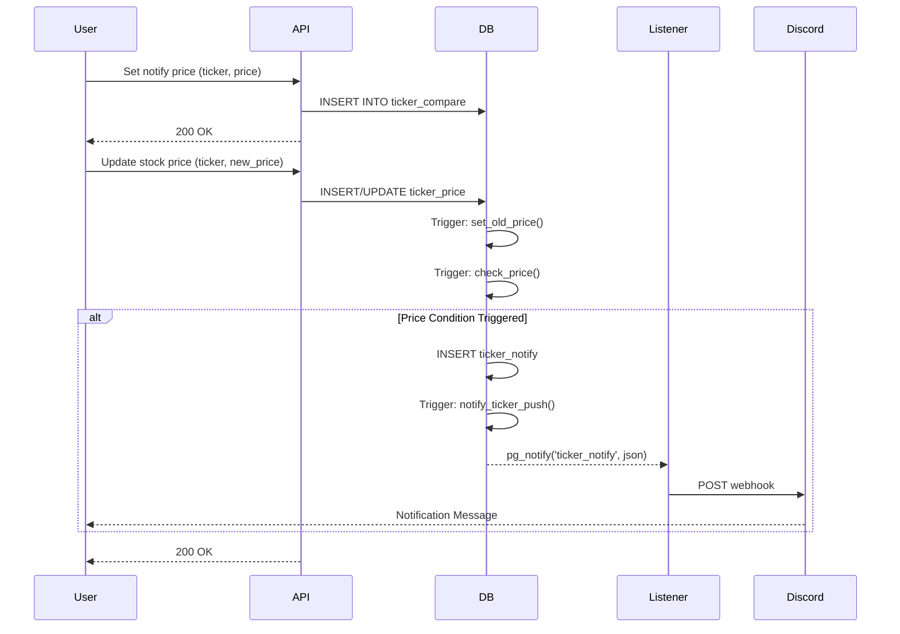

# Stock Notification

[](https://go.dev/)
[](LICENSE)

A stock price notification system that sends real-time alerts via Discord Webhook when stock prices reach configured target levels.

## Table of Contents

- [Features](#features)
- [System Architecture](#system-architecture)
- [Data Flow](#data-flow)
- [Installation](#installation)
- [Usage](#usage)
- [API Endpoints](#api-endpoints)
- [Database Schema](#database-schema)
- [Configuration](#configuration)
- [Tech Stack](#tech-stack)

## Features

- **Real-time Price Monitoring**: Leverages PostgreSQL LISTEN/NOTIFY mechanism for instant updates
- **Price Trigger Notifications**: Automatic alerts when stock prices break above or below target levels
- **Discord Integration**: Sends formatted notification messages via Discord Webhook
- **RESTful API**: Simple HTTP API for setting stock prices and notification conditions
- **Automatic Price Tracking**: Records price change history (new price / old price)
- **Containerized Deployment**: One-command startup using Docker Compose

## System Architecture



## Data Flow

The system implements automated monitoring through PostgreSQL triggers and notification mechanisms:



### Trigger Logic

1. **set_old_price**: Automatically saves the old value to `old_price` when `new_price` updates
2. **check_price**: Checks if price meets notification conditions:
   - **Upward Breakout**: old_price < target_price ≤ new_price
   - **Downward Breakdown**: old_price ≥ target_price > new_price
3. **notify_ticker_push**: Sends notification event via `pg_notify` to listening channel

## Installation

### Prerequisites

- Go 1.25.1+
- Docker and Docker Compose
- Discord Webhook URL

### Steps

1. **Clone the repository**

```bash
git clone <repository-url>
cd stock-notification
```

2. **Configure environment variables**

Create a `.env` file:

```bash
DB_USER=postgres
DB_PASSWORD=password
DB_NAME=database
DB_PORT=5432
```

3. **Set up Discord Webhook**

Modify the `sendToDiscord` function in `main.go` and replace the Discord Webhook URL with yours:

```go
resp, err := http.Post(
    "https://discord.com/api/webhooks/YOUR_WEBHOOK_ID/YOUR_WEBHOOK_TOKEN",
    "application/json",
    bytes.NewBuffer(jsonData),
)
```

4. **Start the service**

```bash
docker-compose up -d
```

The service will start at `http://localhost:8080`.

## Usage

### Basic Example

Monitor AAPL (Apple) stock and receive notification when price breaks above $150:

```bash
# 1. Set notification condition (target price $150)
curl "http://localhost:8080/set/AAPL/notify/150"

# 2. Update current price (e.g., $145)
curl "http://localhost:8080/set/AAPL/price/145"

# 3. Price rises to $151 (triggers notification)
curl "http://localhost:8080/set/AAPL/price/151"
# → Discord receives notification: "AAPL is up to touch price"
```

### Downward Breakdown Example

Monitor price breaking below $140:

```bash
# 1. Set notification condition (target price $140)
curl "http://localhost:8080/set/TSLA/notify/140"

# 2. Update current price (e.g., $145)
curl "http://localhost:8080/set/TSLA/price/145"

# 3. Price drops to $138 (triggers notification)
curl "http://localhost:8080/set/TSLA/price/138"
# → Discord receives notification: "TSLA is down to the price"
```

## API Endpoints

### Set Notification Price

Set the target notification price for a stock.

```http
GET /set/:ticker/notify/:price
```

**Parameters:**
- `ticker` (string): Stock ticker symbol (e.g., AAPL, TSLA)
- `price` (float): Target notification price

**Example:**
```bash
curl "http://localhost:8080/set/AAPL/notify/150"
```

**Response:**
```
ok
```

### Update Stock Price

Update the current price of a stock and trigger notification checks.

```http
GET /set/:ticker/price/:price
```

**Parameters:**
- `ticker` (string): Stock ticker symbol
- `price` (float): New stock price

**Example:**
```bash
curl "http://localhost:8080/set/AAPL/price/151.50"
```

**Response:**
```
ok
```

## Database Schema

### ticker_price

Stores stock price information and history.

| Column | Type | Description |
|--------|------|-------------|
| ticker | VARCHAR(10) | Stock ticker symbol (primary key) |
| new_price | DECIMAL(10,2) | Current price |
| old_price | DECIMAL(10,2) | Previous price |
| updated | TIMESTAMPTZ | Update timestamp |

### ticker_compare

Stores target prices for monitoring.

| Column | Type | Description |
|--------|------|-------------|
| ticker | VARCHAR(10) | Stock ticker symbol (primary key) |
| price | DECIMAL(10,2) | Target notification price |

### ticker_notify

Records triggered notification events.

| Column | Type | Description |
|--------|------|-------------|
| ticker | VARCHAR(10) | Stock ticker symbol (primary key) |
| content | VARCHAR(20) | Notification content |
| direction | VARCHAR(10) | Direction (up/down) |
| price | DECIMAL(10,2) | Price when triggered |
| notified | TIMESTAMPTZ | Notification timestamp |

## Configuration

### Database Connection

Modify database configuration in `main.go` (or use environment variables):

```go
config := db{
    host:     "postgres",
    port:     "5432",
    user:     "postgres",
    password: "password",
    dbName:   "database",
    sslMode:  "disable",
}
```

### Server Port

Default server port is `8080`, can be modified in `main.go`:

```go
srv := &http.Server{
    Addr:    ":8080",
    Handler: r,
}
```

### Discord Notification Format

Customize Discord Embed format by modifying the `sendToDiscord` function:

```go
webhook := DiscordWebhook{
    Embeds: []Embed{
        {
            Title:       title,
            Description: description,
            Color:       3447003,  // Blue
            Timestamp:   time.Now().Format(time.RFC3339),
        },
    },
}
```

## Tech Stack

- **Language**: Go 1.25.1
- **Web Framework**: [Gin](https://github.com/gin-gonic/gin) v1.11.0
- **Database**: PostgreSQL 18.1
- **Database Driver**: [lib/pq](https://github.com/lib/pq) v1.10.9
- **JSON Serialization**: [Sonic](https://github.com/bytedance/sonic) v1.14.0
- **Containerization**: Docker & Docker Compose

### Key Technologies

- **PostgreSQL LISTEN/NOTIFY**: Implements database event-driven real-time notifications
- **Database Triggers**: Uses PL/pgSQL for automated price monitoring logic
- **Gin Middleware**: Built-in Recovery middleware for panic handling
- **Context-based Shutdown**: Uses `signal.NotifyContext` for graceful service shutdown

## How It Works

1. User sets stock ticker and target notification price via API
2. When stock price updates, PostgreSQL triggers automatically check notification conditions
3. If conditions are met, notification data is written to `ticker_notify` table
4. `notify_ticker_push` trigger sends event via `pg_notify`
5. Go application's `pq.Listener` listens for events
6. Upon receiving event, parses JSON and sends notification via Discord Webhook

## Important Notes

- Replace Discord Webhook URL with your actual URL
- For production, move sensitive information (database password, Webhook URL) to environment variables
- Uses `gin.ReleaseMode` by default, can change to `gin.DebugMode` for development
- Listener executes `Ping()` every 30 seconds to ensure connection validity

## License

See LICENSE file in the project.
