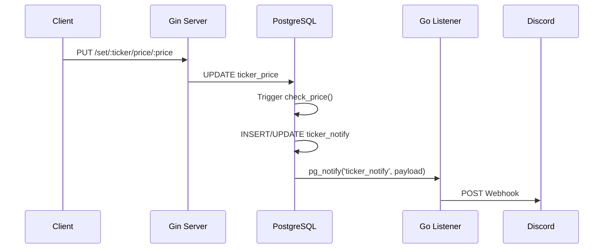

> [!NOTE]
> 此 README 由 [Claude Code](https://gist.github.com/pardnchiu/b09c9bf1166ec7759cbbeeae2e4e93df) 生成，英文版請參閱 [這裡](./README.md)。

# go-stock-notification

> 基於 PostgreSQL LISTEN/NOTIFY 機制的股票價格通知服務，當價格觸及設定目標時自動推送 Discord 通知。

## 功能特點

- **資料庫驅動通知**：利用 PostgreSQL Trigger + pg_notify 實現即時價格監控，無需輪詢
- **Discord 整合**：透過 Webhook 發送格式化的嵌入式通知訊息
- **RESTful API**：提供簡潔的 HTTP 端點設定價格與通知門檻

## 架構



## 安裝

```bash
# 複製專案
git clone https://github.com/neurowatt-dev/go-stock-notification.git
cd go-stock-notification

# 複製環境變數範本
cp .env.example .env
# 編輯 .env 填入資料庫與 Discord Webhook 設定

# 使用 Docker Compose 啟動
docker compose up -d
```

## 使用方法

### 設定通知門檻

設定當股票價格觸及指定價位時觸發通知：

```bash
# 設定 AAPL 的通知價格為 150.00
curl http://localhost:8080/set/AAPL/notify/150.00
```

### 更新股票價格

更新股票最新價格，若穿越通知門檻將自動推送：

```bash
# 更新 AAPL 價格為 151.50
curl http://localhost:8080/set/AAPL/price/151.50
```

### 通知邏輯

- **向上突破**：當價格從低於門檻上升至高於或等於門檻時觸發
- **向下跌破**：當價格從高於或等於門檻下降至低於門檻時觸發
- **方向變化**：僅在方向改變時發送通知，避免重複推送

## 設定參考

### 環境變數

| 變數 | 說明 | 預設值 |
|------|------|--------|
| `DB_USER` | PostgreSQL 使用者 | `postgres` |
| `DB_PASSWORD` | PostgreSQL 密碼 | `password` |
| `DB_NAME` | 資料庫名稱 | `database` |
| `DB_PORT` | 資料庫連接埠 | `5432` |

### 資料庫結構

| 資料表 | 用途 |
|--------|------|
| `ticker_price` | 儲存股票代碼與最新/前次價格 |
| `ticker_compare` | 儲存通知門檻價格 |
| `ticker_notify` | 儲存通知狀態與觸發方向 |

### API 端點

| 方法 | 路徑 | 說明 |
|------|------|------|
| GET | `/set/:ticker/notify/:price` | 設定通知門檻 |
| GET | `/set/:ticker/price/:price` | 更新股票價格 |

## 授權

此專案為私有專案。

## Author


<h4 style="padding-top: 0">邱敬幃 Pardn Chiu</h4>

<a href="mailto:dev@pardn.io" target="_blank">

</a> <a href="https://linkedin.com/in/pardnchiu" target="_blank">

</a>

***

©️ 2026 [邱敬幃 Pardn Chiu](https://linkedin.com/in/pardnchiu)
