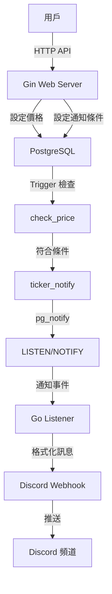
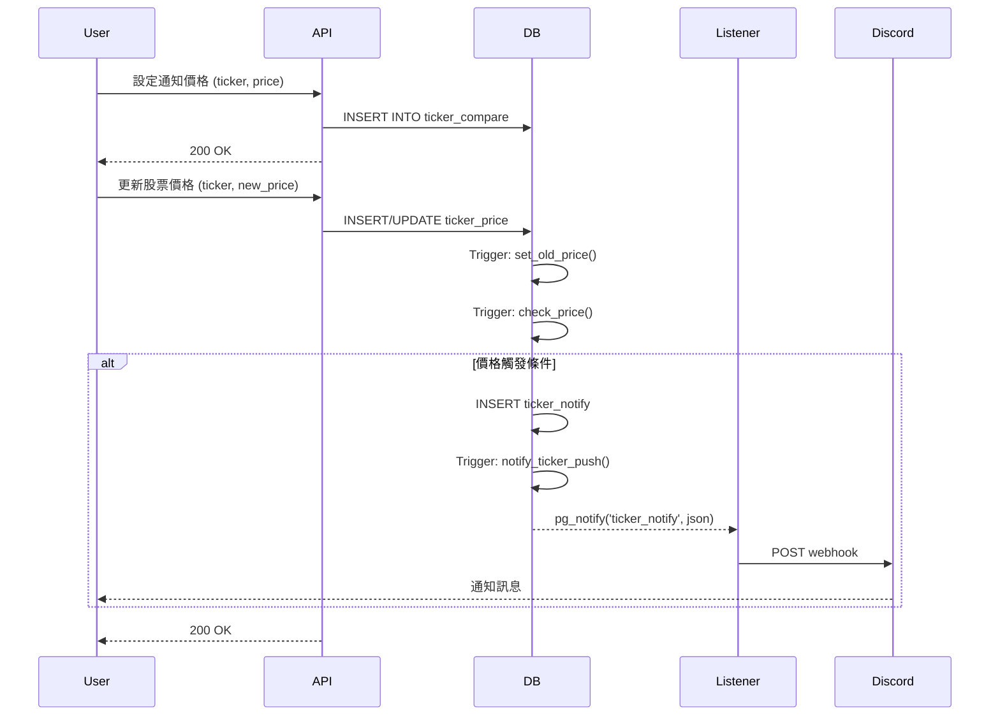

# Stock Notification

[](https://go.dev/)
[](LICENSE)

股票價格通知系統，當股價達到設定的目標價格時，透過 Discord Webhook 即時發送通知。

## 目錄

- [功能特色](#功能特色)
- [系統架構](#系統架構)
- [資料流程](#資料流程)
- [安裝](#安裝)
- [使用方法](#使用方法)
- [API 端點](#api-端點)
- [資料庫架構](#資料庫架構)
- [配置](#配置)
- [技術棧](#技術棧)

## 功能特色

- **即時價格監控**：透過 PostgreSQL LISTEN/NOTIFY 機制實現即時監控
- **價格觸發通知**：當股價上漲突破或下跌跌破設定價格時自動通知
- **Discord 整合**：透過 Discord Webhook 發送格式化的通知訊息
- **RESTful API**：簡潔的 HTTP API 用於設定股票價格和通知條件
- **自動價格追蹤**：自動記錄價格變動歷史（新價格 / 舊價格）
- **容器化部署**：使用 Docker Compose 一鍵啟動

## 系統架構



## 資料流程

系統透過 PostgreSQL 的觸發器（Trigger）和通知機制實現自動化監控：



### 觸發邏輯

1. **set_old_price**: 當 `new_price` 更新時，自動將舊值保存到 `old_price`
2. **check_price**: 檢查價格是否觸發通知條件：
   - **向上突破**：舊價格 < 目標價格 ≤ 新價格
   - **向下跌破**：舊價格 ≥ 目標價格 > 新價格
3. **notify_ticker_push**: 將通知事件透過 `pg_notify` 發送到監聽通道

## 安裝

### 前置需求

- Go 1.25.1+
- Docker 和 Docker Compose
- Discord Webhook URL

### 步驟

1. **複製專案**

```bash
git clone <repository-url>
cd stock-notification
```

2. **配置環境變數**

建立 `.env` 檔案：

```bash
DB_USER=postgres
DB_PASSWORD=password
DB_NAME=database
DB_PORT=5432
```

3. **設定 Discord Webhook**

修改 `main.go` 中的 `sendToDiscord` 函式，將 Discord Webhook URL 替換為你的 URL：

```go
resp, err := http.Post(
    "https://discord.com/api/webhooks/YOUR_WEBHOOK_ID/YOUR_WEBHOOK_TOKEN",
    "application/json",
    bytes.NewBuffer(jsonData),
)
```

4. **啟動服務**

```bash
docker-compose up -d
```

服務將在 `http://localhost:8080` 啟動。

## 使用方法

### 基本範例

假設你想監控 AAPL（蘋果）股票，當價格突破 $150 時接收通知：

```bash
# 1. 設定通知條件（目標價格 $150）
curl "http://localhost:8080/set/AAPL/notify/150"

# 2. 更新當前價格（例如 $145）
curl "http://localhost:8080/set/AAPL/price/145"

# 3. 價格上漲到 $151（觸發通知）
curl "http://localhost:8080/set/AAPL/price/151"
# → Discord 將收到通知：「AAPL is up to touch price」
```

### 向下跌破範例

監控價格跌破 $140 的情況：

```bash
# 1. 設定通知條件（目標價格 $140）
curl "http://localhost:8080/set/TSLA/notify/140"

# 2. 更新當前價格（例如 $145）
curl "http://localhost:8080/set/TSLA/price/145"

# 3. 價格下跌到 $138（觸發通知）
curl "http://localhost:8080/set/TSLA/price/138"
# → Discord 將收到通知：「TSLA is down to the price」
```

## API 端點

### 設定通知價格

設定股票的目標通知價格。

```http
GET /set/:ticker/notify/:price
```

**參數：**
- `ticker` (string): 股票代碼（例如：AAPL, TSLA）
- `price` (float): 目標通知價格

**範例：**
```bash
curl "http://localhost:8080/set/AAPL/notify/150"
```

**回應：**
```
ok
```

### 更新股票價格

更新股票的當前價格，並觸發通知檢查。

```http
GET /set/:ticker/price/:price
```

**參數：**
- `ticker` (string): 股票代碼
- `price` (float): 新的股票價格

**範例：**
```bash
curl "http://localhost:8080/set/AAPL/price/151.50"
```

**回應：**
```
ok
```

## 資料庫架構

### ticker_price

存儲股票的價格資訊和歷史。

| 欄位 | 型別 | 說明 |
|------|------|------|
| ticker | VARCHAR(10) | 股票代碼（主鍵） |
| new_price | DECIMAL(10,2) | 當前價格 |
| old_price | DECIMAL(10,2) | 前一次價格 |
| updated | TIMESTAMPTZ | 更新時間 |

### ticker_compare

存儲需要監控的目標價格。

| 欄位 | 型別 | 說明 |
|------|------|------|
| ticker | VARCHAR(10) | 股票代碼（主鍵） |
| price | DECIMAL(10,2) | 目標通知價格 |

### ticker_notify

記錄觸發的通知事件。

| 欄位 | 型別 | 說明 |
|------|------|------|
| ticker | VARCHAR(10) | 股票代碼（主鍵） |
| content | VARCHAR(20) | 通知內容 |
| direction | VARCHAR(10) | 方向（up/down） |
| price | DECIMAL(10,2) | 觸發時的價格 |
| notified | TIMESTAMPTZ | 通知時間 |

## 配置

### 資料庫連線

在 `main.go` 中修改資料庫配置（或使用環境變數）：

```go
config := db{
    host:     "postgres",
    port:     "5432",
    user:     "postgres",
    password: "password",
    dbName:   "database",
    sslMode:  "disable",
}
```

### 伺服器埠號

預設伺服器埠為 `8080`，可在 `main.go` 中修改：

```go
srv := &http.Server{
    Addr:    ":8080",
    Handler: r,
}
```

### Discord 通知格式

可自訂 Discord Embed 的格式，修改 `sendToDiscord` 函式：

```go
webhook := DiscordWebhook{
    Embeds: []Embed{
        {
            Title:       title,
            Description: description,
            Color:       3447003,  // 藍色
            Timestamp:   time.Now().Format(time.RFC3339),
        },
    },
}
```

## 技術棧

- **語言**: Go 1.25.1
- **Web 框架**: [Gin](https://github.com/gin-gonic/gin) v1.11.0
- **資料庫**: PostgreSQL 18.1
- **資料庫驅動**: [lib/pq](https://github.com/lib/pq) v1.10.9
- **JSON 序列化**: [Sonic](https://github.com/bytedance/sonic) v1.14.0
- **容器化**: Docker & Docker Compose

### 關鍵技術

- **PostgreSQL LISTEN/NOTIFY**: 實現資料庫事件驅動的即時通知
- **Database Triggers**: 使用 PL/pgSQL 實現自動化價格監控邏輯
- **Gin Middleware**: 內建 Recovery 中介軟體處理 panic
- **Context-based Shutdown**: 使用 `signal.NotifyContext` 優雅關閉服務

## 運作原理

1. 使用者透過 API 設定股票代碼和目標通知價格
2. 當股票價格更新時，PostgreSQL 觸發器自動檢查是否滿足通知條件
3. 若滿足條件，將通知資料寫入 `ticker_notify` 表
4. `notify_ticker_push` 觸發器透過 `pg_notify` 發送事件
5. Go 應用程式的 `pq.Listener` 監聽事件
6. 收到事件後，解析 JSON 並透過 Discord Webhook 發送通知

## 注意事項

- Discord Webhook URL 需替換為實際的 URL
- 生產環境建議將敏感資訊（如資料庫密碼、Webhook URL）移至環境變數
- 預設使用 `gin.ReleaseMode`，開發時可改為 `gin.DebugMode`
- 監聽器每 30 秒會執行一次 `Ping()` 確保連線有效

## 授權

請參閱專案中的 LICENSE 檔案。
